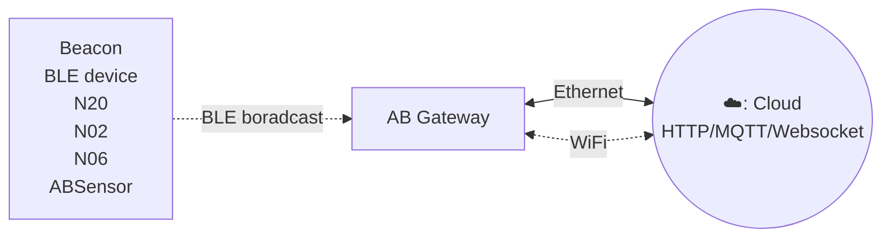

# AB BLE gateway v4 #

## Description

AB BLE Gateway V4, designed for monitoring BLE advertisisements, including popular formats such as iBeacon, Eddystone, and custom sensor data. The Gateway seamlessly captures this advertising data and transmits it to LAN or internet servers, enabling efficient data collection and monitoring for a wide range of applications.

Gateway supports Ethernet and WiFi connection. User can configure the transmit period and server information through a simple HTTP API.

:::tabs

@tab Features

## Features

- Ethernet and Wi-Fi Connectivity
- Support WebSocket/HTTP/MQTT protocol
- External antenna for BLE
- Reads multiple BLE devices in the same time and upload to remote server
- User-Friendly Configuration Tool: The Gateway comes with a user-friendly configuration tool that provides a graphical interface for easy setup.

## How it works ##

## Applications

  - iBeacon/Eddystone/tag receiver for location tracking
  - BLE sensor reader for sensor network
  - Building automation
  - Health and wellness monitoring
  - Cycling, biking
  - Security
  - Location tracking
  - Access management
  - Advertisement
  - Industrial automation
  - Indoor Location
  - Meeting sign in
  - Check in
  - Parking & Checking in
  - Home automation

## Certifications

* FCCID: `2ACAL-ABBG0004`
* CE No.: `ATSZAWW190102008`

@tab Specifications

## Specifications ##

- Size: 72mmx74mmx20mm
- Power Input: DC 5V/2000mA, micro-USB or Standard POE 48V
- Operating temperature: -20'C to 60'C

### BLE

- BLE is based on NRF52832 
- BLE with external PCB antenna
- Bi-direction: Reads message advertised from BLE devices 
- 30M range in open space

### Wi-Fi

  - WiFi is based on ESP32
  - Support 802.11 b/g/n/e/i (802.11n, Speed 150 Mbps)
  - 2.4GHz frequency band
  - Transmit power:
      - \+20dBm @802.11b
      - \+14dBm @802.11n
  - WiFi data rate up to 150Mbps
  - WiFi with on board PCB antenna
  - HTTP api for configuration
  - Connect to Cloud server or local server
  - 100M range in open space

### Ethernet

  - full-duplex 10-BASE-T/100BASE-TX transceiver and supports 10Mbps
    (10BASE-T) and 100Mbps (100BASE-TX) operation.
  - 15W Power Over Ethernet Meets IEEE 802. 3 af Specifications

:::

## Documents And Links

- [Quick Start](Quick_Start_For_AB_BLE_Gateway_V4.md)
- [User Guide](User_Guide_For_AB_BLE_Gateway_V4.md)
- [Software and technical documents](Software_AB_BLE_Gateway_V4.md)
- [Support Forum](http://bbs.aprbrother.com/c/wifi)
- [FAQ](FAQ_For_AB_BLE_Gateway_V4.md)

