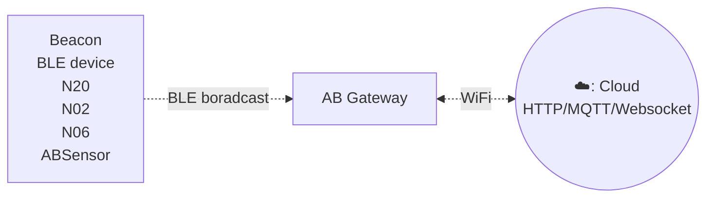

# Gateway c3 #

Gateway c3, designed for monitoring BLE advertisisements, including popular formats such as iBeacon, Eddystone, and custom sensor data. The Gateway seamlessly captures this advertising data and transmits it to LAN or internet servers, enabling efficient data collection and monitoring for a wide range of applications.

It supports WiFi connection and easy to installation. User can configure the transmit period and server information through a simple configure tool.

## Model comparison ##

Gateway C3A can work without external power cord beacuse it has a builtin rechargeable 800mAH battery. C3A can save data even without network connection.

Comparison C3 and C3A

| Features                       | C3  | C3A    |
| ------------------------------ | --- | ------ |
| 2.4GHz WiFi & BLE              | YES | YES    |
| Rechargeable battery (800mAH)  | NO  | YES    |
| Data saving even offline       | NO  | YES    |

:::tabs

@tab Features

## Features

- Wi-Fi Connectivity
- Support WebSocket/HTTP/MQTT protocol
- Reads multiple BLE devices in the same time and upload to remote server
- User-Friendly Configuration Tool: The Gateway comes with a user-friendly configuration tool that provides a graphical interface for easy setup.

## How it works ##

## Applications

- iBeacon/Eddystone/tag receiver for location tracking
- BLE sensor reader for sensor network
- Building automation
- Health and wellness monitoring
- Cycling, biking
- Security
- Location tracking
- Access management
- Advertisement
- Industrial automation
- Indoor Location
- Meeting sign in
- Check in
- Parking & Checking in
- Home automation

@tab Specifications

- Size: 59mm * 59mm * 11mm
- Power Input: DC 5V/2000mA, USB-C port
- Operating temperature: -20'C to 55'C
- Network connection: WiFi
- BLE 4.2
- Firmware upgrade: OTA

:::

## Documents And Links ##

- [Quick start](gwc3/quickstart.md)
- [Software and technical documents](gwc3/tech.md)
- [Support Forum](https://bbs.aprbrother.com/c/wifi)
