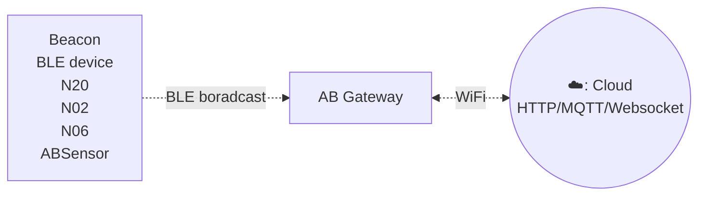
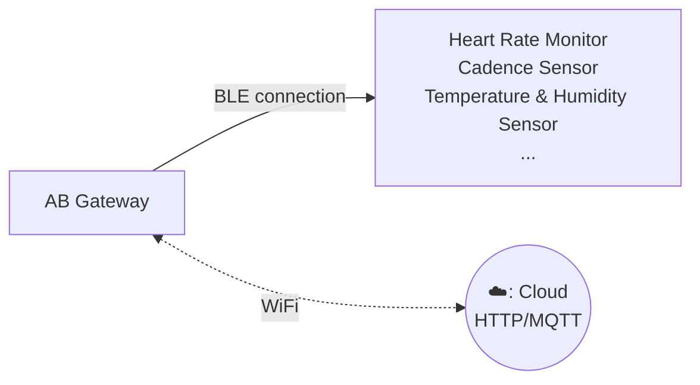

# Gateway c3 #

Gateway C3 is specifically designed for monitoring BLE data. This gateway seamlessly captures the BLE data and transmits it to a local area network or internet server, enabling efficient data collection and monitoring for various application scenarios.

It supports WiFi connection and easy to installation. User can configure the transmit period and server information through a simple configure tool.

## Model comparison ##

Gateway C3A can work without external power cord beacuse it has a builtin rechargeable 600mAH battery. C3A can save data even without network connection.

Comparison C3 and C3A

| Features                       | C3  | C3A    |
| ------------------------------ | --- | ------ |
| 2.4GHz WiFi & BLE              | ✓   | ✓      |
| Rechargeable battery (600mAH)  | x   | ✓      |
| Data saving even offline       | x   | ✓      |

## Features ##

:::tabs

@tab Features of Scanning Gateway

The scanning gateway can scan nearby BLE broadcast packets, such as iBeacon, Eddystone, or custom broadcast data formats, and upload them to the server via HTTP or MQTT.

- Wi-Fi Connectivity
- Support HTTP/MQTT protocol
- Reads multiple BLE devices in the same time and upload to remote server
- User-Friendly Configuration Tool: The Gateway comes with a user-friendly configuration tool that provides a graphical interface for easy setup.

## How it works ##

## Performance ##

* Scan duration = 1 second
* Upload maximum 170 ~ 180 advertsing data per second

## Applications ##

- iBeacon/Eddystone/tag receiver for location tracking
- BLE sensor reader for sensor network
- Building automation
- Health and wellness monitoring
- Cycling, biking
- Security
- Location tracking
- Access management
- Advertisement
- Industrial automation
- Indoor Location
- Meeting sign in
- Check in
- Parking & Checking in
- Home automation

@tab Features of Connection Gateway

The connection gateway is a high-performance device specifically designed to connect with BLE low-energy sensors. It can connect with various BLE sensors via the GATT protocol to obtain real-time key health information, such as heart rate and cadence, and upload the data to the server via the MQTT protocol. It supports WiFi connectivity, ensuring stable and reliable data transmission.

* Supports simultaneous connection of up to 9 BLE devices
* Effective connection radius of 15 meters without obstruction
* Connects with various BLE sensors via the GATT protocol to obtain real-time physiological data such as heart rate and cadence
* Supports Wi-Fi connectivity
* Supports HTTP/MQTT protocols
* Can simultaneously read multiple BLE devices and upload data to a remote server
* User-friendly configuration tool: The gateway comes with a user-friendly configuration tool that provides a graphical interface for easy setup.
* Suitable for various environments such as gyms and homes, meeting different user needs.

## How it works ##

## Applications ##

* Health Monitoring: Suitable for environments such as gyms, hospitals, and homes, providing real-time monitoring of users' health metrics.
* Sports Analysis: Offers precise data support for athletes, helping to optimize training effectiveness.
* Remote Healthcare: Provides remote monitoring solutions for medical institutions, enabling better patient management.

@tab Specifications

- Size: 59mm * 59mm * 11mm
- Power Input: DC 5V/2000mA, USB-C port
- Operating temperature: -20°C to 55°C
- Network connection: WiFi
- BLE 4.2
- Firmware upgrade: OTA

:::

## Documents And Links ##

- [Quick start](gwc3/quickstart.md)
- [Software and technical documents](gwc3/tech.md)
- [Support Forum](https://bbs.aprbrother.com/c/wifi)
