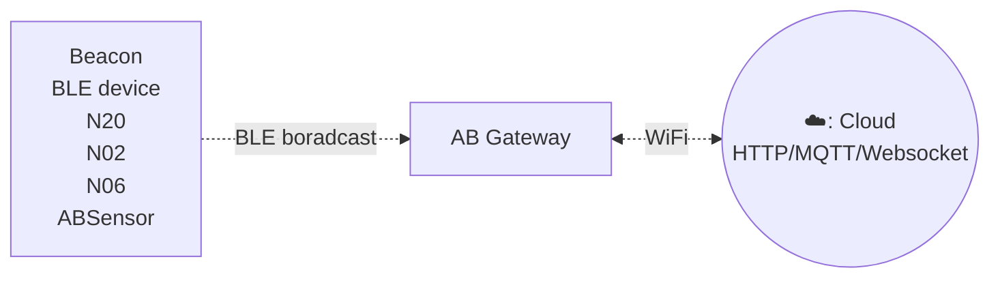
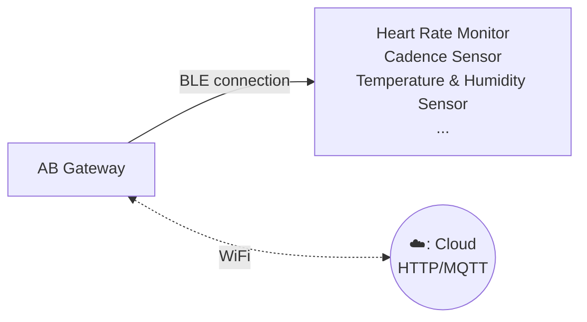

# Gateway c5 #

Gateway C5 is a versatile BLE gateway that supports two working modes: **Scanning** and **Connection**. It seamlessly captures the BLE data and transmits it to a local area network or internet server, enabling efficient data collection and monitoring for various application scenarios.

::: warning
The gateway supports both Scanning and Connection functionality, but it can only work in **one mode at a time**. You need to choose the mode that fits your use case.
:::

The gateway is easy to install and shares the following features across both modes:

- Wi-Fi connectivity (2.4GHz / 5GHz)
- Supports HTTP/MQTT protocol
- Reads multiple BLE devices at the same time and uploads them to a remote server
- User-friendly configuration tool: provides a graphical interface for easy setup
- Configurable transmit period and server information

## Features ##

:::tabs

@tab Scanning Mode

In Scanning mode, the gateway scans nearby BLE broadcast packets, such as iBeacon, Eddystone, or custom broadcast data formats, and uploads them to the server via HTTP or MQTT.

## How it works ##

## Performance ##

* Scan duration = 1 second
* Upload maximum 170 ~ 180 advertsing data per second

## Applications ##

- iBeacon/Eddystone/tag receiver for location tracking
- BLE sensor reader for sensor network
- Building automation
- Health and wellness monitoring
- Cycling, biking
- Security
- Location tracking
- Access management
- Advertisement
- Industrial automation
- Indoor Location
- Meeting sign in
- Check in
- Parking & Checking in
- Home automation

@tab Connection Mode

In Connection mode, the gateway connects to BLE low-energy sensors via the GATT protocol to obtain real-time health information such as heart rate and cadence, and uploads the data to the server via MQTT.

* Supports simultaneous connection of up to 12 BLE devices
* Effective connection radius of 15 meters without obstruction
* Connects with various BLE sensors via the GATT protocol to obtain real-time physiological data such as heart rate and cadence
* Suitable for various environments such as gyms and homes, meeting different user needs.

## How it works ##

## Applications ##

* Health Monitoring: Suitable for environments such as gyms, hospitals, and homes, providing real-time monitoring of users' health metrics.
* Sports Analysis: Offers precise data support for athletes, helping to optimize training effectiveness.
* Remote Healthcare: Provides remote monitoring solutions for medical institutions, enabling better patient management.

@tab Specifications

- Size: 59mm * 59mm * 11mm
- Power Input: DC 5V/2000mA, USB-C port
- Operating temperature: -20°C to 55°C
- Network connection: WiFi (2.4GHz / 5GHz)
- BLE 4.2
- Firmware upgrade: OTA

:::

## Documents And Links ##

- [Quick start](gwc3/quickstart.md)
- [Software and technical documents](gwc3/tech.md)
- [Support Forum](https://bbs.aprbrother.com/c/wifi)
