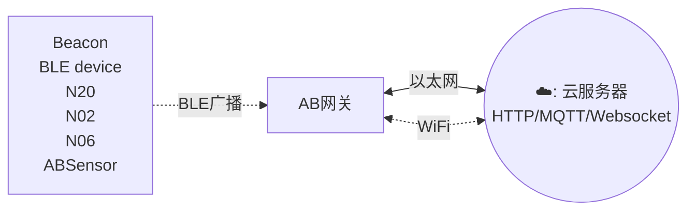

# AB BLE gateway v4 #

## 介绍

AB BLE Gateway V4是专为监控BLE（低功耗蓝牙）广告而设计的，包括iBeacon、Eddystone和自定义传感器数据等流行格式。该网关无缝地捕获这些广告数据并将其传输到局域网或互联网服务器，为各种应用场景实现高效的数据收集和监控。

该网关支持以太网和WiFi连接。用户可以通过简单的HTTP API配置传输周期和服务器信息。

:::tabs

@tab 特点

## Features

- 支持以太网和Wi-Fi连接
- 支持WebSocket/HTTP/MQTT协议
- BLE的外部天线
- 可同时读取多个BLE设备并上传到远程服务器
- 用户友好的配置工具: 该网关配备了用户友好的配置工具，提供图形界面，方便进行设置。

## 它是如何工作的? ##

## 应用场景

  - iBeacon/Eddystone/tag receiver for location tracking
  - BLE sensor reader for sensor network
  - Building automation
  - Health and wellness monitoring
  - Cycling, biking
  - Security
  - Location tracking
  - Access management
  - Advertisement
  - Industrial automation
  - Indoor Location
  - Meeting sign in
  - Check in
  - Parking & Checking in
  - Home automation

## 认证

* FCCID: `2ACAL-ABBG0004`
* CE No.: `ATSZAWW190102008`

@tab 技术规格

## 技术规格 ##

- 尺寸: 72mmx74mmx20mm
- 电源: DC 5V/2000mA, micro-USB 或者标准POE 48V
- 工作温度: -20摄氏度 ~ 60摄氏度

### BLE

- BLE is based on NRF52832 
- 外置天线
- Bi-direction: Reads message advertised from BLE devices 
- 30M range in open space

### Wi-Fi

  - WiFi is based on ESP32
  - Support 802.11 b/g/n/e/i (802.11n, Speed 150 Mbps)
  - 2.4GHz frequency band
  - Transmit power:
      - \+20dBm @802.11b
      - \+14dBm @802.11n
  - WiFi data rate up to 150Mbps
  - WiFi with on board PCB antenna
  - HTTP api for configuration
  - Connect to Cloud server or local server
  - 100M range in open space

### Ethernet

  - full-duplex 10-BASE-T/100BASE-TX transceiver and supports 10Mbps
    (10BASE-T) and 100Mbps (100BASE-TX) operation.
  - 15W Power Over Ethernet Meets IEEE 802. 3 af Specifications

:::

## Documents And Links

- [快速上手](Quick_Start_For_AB_BLE_Gateway_V4.md)
- [使用手册](User_Guide_For_AB_BLE_Gateway_V4.md)
- [软件和技术文档](Software_AB_BLE_Gateway_V4.md)
- [支持论坛](http://bbs.aprbrother.com/c/wifi)
- [常见问题](FAQ_For_AB_BLE_Gateway_V4.md)

