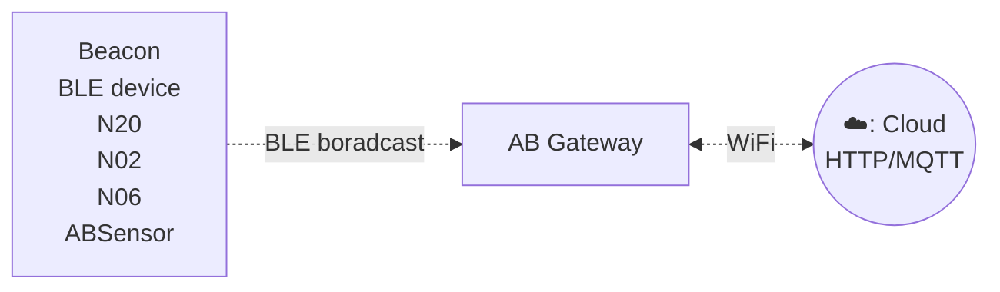
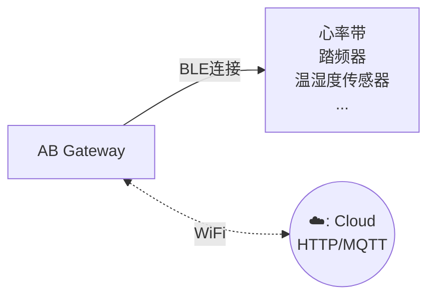

# Gateway c3 #

Gateway C3是专为监控BLE数据而设计的，该网关无缝地捕获这些BLE数据并将其传输到局域网或互联网服务器，为各种应用场景实现高效的数据收集和监控。

该网关支持WiFi连接。用户可以通过简单的HTTP API配置传输周期和服务器信息。

## 型号对比 ##

C3A网关可以在没有外接电源适配器的情况下工作，因为它内置了一个600毫安时的电池。C3A网关也可以在离线的情况下保存数据在内部。

C3和C3A的对比

| Features                       | C3 | C3A  |
| ------------------------------ | -- | ---- |
| 2.4GHz WiFi & BLE              | ✓  | ✓    |
| 可充电电池 (600mAH)            | x  | ✓    |
| 离线保存数据                   | x  | ✓    |

## 特点 ##

:::tabs

@tab 扫描网关特点

扫描版网关可扫描周围的BLE广播包例如iBeacon, Eddystone或自定义的广播包数据格式，并通过HTTP或者MQTT方式上传到服务器。

- 支持Wi-Fi连接
- 支持HTTP/MQTT协议
- 可同时读取多个BLE设备并上传到远程服务器
- 用户友好的配置工具: 该网关配备了用户友好的配置工具，提供图形界面，方便进行设置。

## 它是如何工作的? ##

## 应用场景

- iBeacon/Eddystone/tag receiver for location tracking
- BLE sensor reader for sensor network
- Building automation
- Health and wellness monitoring
- Cycling, biking
- Security
- Location tracking
- Access management
- Advertisement
- Industrial automation
- Indoor Location
- Meeting sign in
- Check in
- Parking & Checking in
- Home automation

@tab 连接网关特点

连接版网关是一款高性能设备，专为连接BLE低功耗传感器而设计。它能够通过GATT协议与多种 BLE 传感器连接，实时获取心率、踏频等关键健康信息，并通过MQTT协议将数据上传至服务器，支持 WiFi 连接，确保数据传输的稳定性与可靠性。

- 最大支持同时连接 9 个BLE设备
- 有效连接半径为无遮挡15米
- 通过GATT协议与多种 BLE 传感器连接，实时获取心率、踏频等生理数据
- 支持Wi-Fi连接
- 支持HTTP/MQTT协议
- 可同时读取多个BLE设备并上传到远程服务器
- 用户友好的配置工具: 该网关配备了用户友好的配置工具，提供图形界面，方便进行设置。
- 适用于健身房、家庭等多种环境，满足不同用户需求。

## 它是如何工作的? ##

## 应用场景 ##

* 健康监测：适用于健身房、医院和家庭等环境，实时监测用户的健康指标。
* 运动分析：为运动员提供精准的数据支持，帮助优化训练效果。
* 远程医疗：为医疗机构提供远程监测解决方案，实现更好的患者管理。

@tab 技术规格

- Size: 59mm * 59mm * 11mm
- Power Input: DC 5V/2000mA, USB-C port
- Operating temperature: -20°C to 55°C
- Network connection: WiFi
- BLE 4.2
- Firmware upgrade: OTA

:::

## 安全警告 ##

重要提示：本网关及其姐妹款不建议用于影响生命安全的场合。虽然设备能提供实时数据监测，但其数据仅供参考，不能替代专业医疗设备或医疗建议。在任何可能影响健康或生命安全的情况下，请务必咨询专业医疗人员。

使用本设备时，用户需自行承担风险和责任。我们建议在关键健康监测和生命安全相关的应用中，始终依赖经过验证的医疗设备和专业医疗服务。

## 文档和相关链接 ##

- [快速上手](gwc3/quickstart.md)
- [软件和技术文档](gwc3/tech.md)
- [支持论坛](http://bbs.aprbrother.com/c/wifi)
