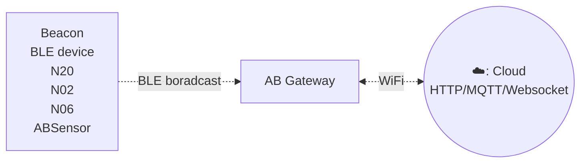

# Gateway c3 #

Gateway C3是专为监控BLE（低功耗蓝牙）广告而设计的，包括iBeacon、Eddystone和自定义传感器数据等流行格式。该网关无缝地捕获这些广告数据并将其传输到局域网或互联网服务器，为各种应用场景实现高效的数据收集和监控。

该网关支持WiFi连接。用户可以通过简单的HTTP API配置传输周期和服务器信息。

## 型号对比 ##

C3A网关可以在没有外接电源适配器的情况下工作，因为它内置了一个800毫安时的电池。C3A网关也可以在离线的情况下保存数据在内部。

C3和C3A的对比

| Features                       | C3 | C3A  |
| ------------------------------ | -- | ---- |
| 2.4GHz WiFi & BLE              | 有 | 有    |
| 可充电电池 (800mAH)            | 无 | 有    |
| 离线保存数据                   | 无 | 有    |

:::tabs

@tab 特点

## Features

- 支持Wi-Fi连接
- 支持WebSocket/HTTP/MQTT协议
- BLE的外部天线
- 可同时读取多个BLE设备并上传到远程服务器
- 用户友好的配置工具: 该网关配备了用户友好的配置工具，提供图形界面，方便进行设置。

## 它是如何工作的? ##

## 应用场景

- iBeacon/Eddystone/tag receiver for location tracking
- BLE sensor reader for sensor network
- Building automation
- Health and wellness monitoring
- Cycling, biking
- Security
- Location tracking
- Access management
- Advertisement
- Industrial automation
- Indoor Location
- Meeting sign in
- Check in
- Parking & Checking in
- Home automation

@tab 技术规格

- Size: 59mm * 59mm * 11mm
- Power Input: DC 5V/2000mA, USB-C port
- Operating temperature: -20'C to 55'C
- Network connection: WiFi
- BLE 4.2
- Firmware upgrade: OTA

:::

## 文档和相关链接 ##

- [快速上手](gwc3/quickstart.md)
- [软件和技术文档](gwc3/tech.md)
- [支持论坛](http://bbs.aprbrother.com/c/wifi)
