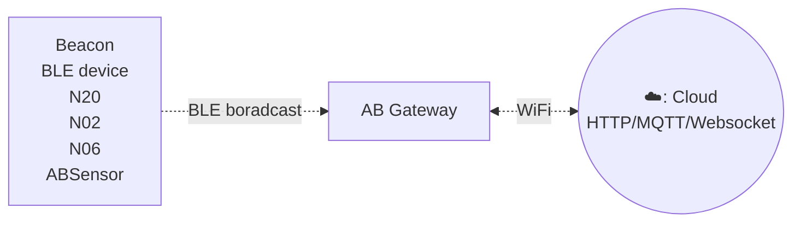
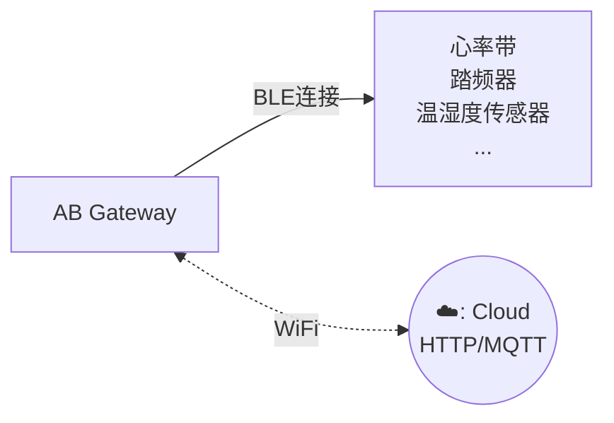

# Gateway c5 #

Gateway C5 是一款多功能的 BLE 网关，支持两种工作模式：**扫描（Scanning）** 和 **连接（Connection）**。它能够无缝地捕获 BLE 数据并将其传输到局域网或互联网服务器，为各种应用场景实现高效的数据收集和监控。

::: warning
该网关同时支持扫描和连接功能，但在同一时刻只能工作于**一种模式**。您需要根据使用场景选择其中一种模式。
:::

该网关支持 WiFi 连接（2.4GHz 和 5GHz），安装简便。用户可以通过简单的配置工具配置传输周期和服务器信息。

## 特点 ##

:::tabs

@tab 扫描网关特点

扫描版网关可扫描周围的 BLE 广播包，例如 iBeacon、Eddystone 或自定义的广播数据格式，并通过 HTTP 或 MQTT 方式上传到服务器。

- 支持 Wi-Fi 连接（2.4GHz / 5GHz）
- 支持 HTTP/MQTT 协议
- 可同时读取多个 BLE 设备并上传到远程服务器
- 用户友好的配置工具：该网关配备了用户友好的配置工具，提供图形界面，方便进行设置。

## 它是如何工作的? ##

## Performance ##

* Scan duration = 1 second
* Upload maximum 170 ~ 180 advertsing data per second

## 应用场景 ##

- iBeacon/Eddystone/标签接收器，用于位置追踪
- BLE 传感器读取器，用于传感器网络
- 楼宇自动化
- 健康与保健监测
- 骑行、单车
- 安防
- 位置追踪
- 出入管理
- 广告推送
- 工业自动化
- 室内定位
- 会议签到
- 签到
- 停车与签到
- 智能家居

@tab 连接网关特点

连接版网关是一款高性能设备，专为连接 BLE 低功耗传感器而设计。它能够通过 GATT 协议与多种 BLE 传感器连接，实时获取心率、踏频等关键健康信息，并通过 MQTT 协议将数据上传至服务器。它支持 WiFi 连接（2.4GHz 和 5GHz），确保数据传输的稳定性与可靠性。

* 最大支持同时连接 9 个 BLE 设备
* 有效连接半径为无遮挡 15 米
* 通过 GATT 协议与多种 BLE 传感器连接，实时获取心率、踏频等生理数据
* 支持 Wi-Fi 连接（2.4GHz / 5GHz）
* 支持 HTTP/MQTT 协议
* 可同时读取多个 BLE 设备并上传到远程服务器
* 用户友好的配置工具：该网关配备了用户友好的配置工具，提供图形界面，方便进行设置。
* 适用于健身房、家庭等多种环境，满足不同用户需求。

## 它是如何工作的? ##

## 应用场景 ##

* 健康监测：适用于健身房、医院和家庭等环境，实时监测用户的健康指标。
* 运动分析：为运动员提供精准的数据支持，帮助优化训练效果。
* 远程医疗：为医疗机构提供远程监测解决方案，实现更好的患者管理。

@tab 技术规格

- Size: 59mm * 59mm * 11mm
- Power Input: DC 5V/2000mA, USB-C port
- Operating temperature: -20°C to 55°C
- Network connection: WiFi (2.4GHz / 5GHz)
- BLE 4.2
- Firmware upgrade: OTA

:::

## 文档和相关链接 ##

- [快速上手](gwc3/quickstart.md)
- [软件和技术文档](gwc3/tech.md)
- [支持论坛](https://bbs.aprbrother.com/c/wifi)
